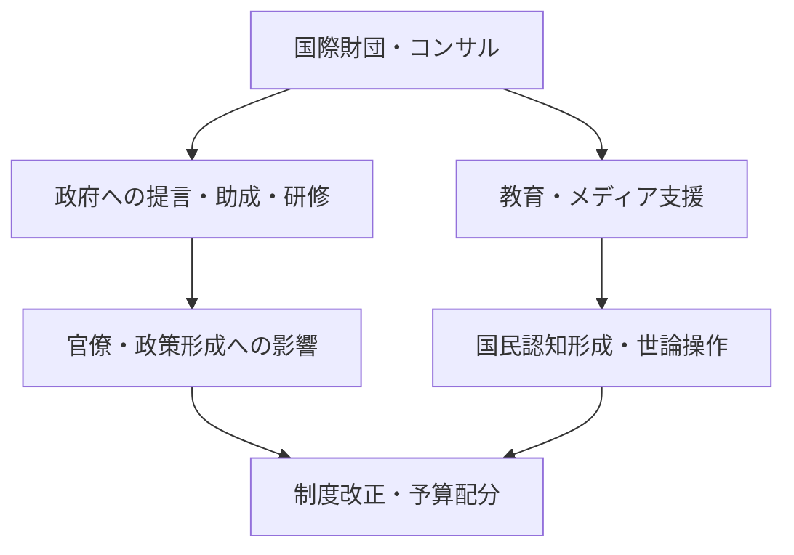

# 「権限なき支配」構造による主権侵害の制度的補完構造（国際構造編）

## 概要

本稿では、国家主権が形式的な合法性を持ちながらも事実上侵害されている構造について、国際的な視野から考察する。対象はNPO、財団法人、多国籍企業、コンサルティングファーム、ITプラットフォームなど、選挙による民主的正統性を持たない民間主体が、制度的手段を通じて政策決定へ直接・間接に影響を及ぼす構造である。これを「制度的補完構造」と定義し、国家機能の非戦争的侵食モデルとして分析する。

## 1. 国家主権の制度的脆弱性

### 1.1 主権の三層構造とその侵食可能性

国家主権は以下の3つの層に区分できる：

- **立法的主権**：議会と憲法制定権
- **行政的主権**：執行機関の統治権限
- **認知的主権**：国民が国家を国家として認識する構造

このうち、立法と行政は形式的には維持される一方、認知的主権が民間情報空間に移管されることで、国家機能の実質的な支配権が移動する。

### 1.2 非戦争的主権移譲

以下のメカニズムを通じて、戦争やクーデターを介さずに主権は徐々に移譲されうる：

- 政策提言型の財団法人や研究機関
- 国家データインフラのクラウドアウトソーシング（例：AWS, Azure）
- 国際機関や条約による主権拘束（例：OECD勧告、WTOルール）
- 通信・医療・教育など中核分野の委託と標準化

## 2. 民間主体による政策決定の代替経路

### 2.1 主権を迂回する構造経路

この構造により、政府は形式的に主権者でありながら、実質的には民間構造が意志決定を代替している。

### 2.2 具体例

- **米国**：BlackRock、Brookingsなどがバイデン政権に政策提言
- **EU**：企業主導の標準化団体（ETSI等）が制度に実質影響
- **アフリカ諸国**：IMFや世銀の融資条件による国内政策の拘束
- **アジア諸国**：教育・保健分野への外国財団の介入（例：ゲイツ財団）

## 3. 制度的補完の成立条件

### 3.1 形式的合法性の保持

これらの構造は、形式上は合法である：

- 契約に基づく業務委託
- 議会で承認された予算配分
- 法律に基づいた助成金や制度変更

### 3.2 抑止不能性

- 責任主体が不明（NPO・コンサル・IT企業）
- 議会・司法が制度に組み込まれているため抵抗できない
- 市民が「公共性」を誤認しているため監視機能が働かない

## 4. 解体不可能性と制度的恒久性

### 4.1 行政依存性の固定化

一度導入された外部支援（コンサル・技術基盤・資金提供）は、恒常的な依存状態を形成し、国家の自律性を麻痺させる。

### 4.2 制度疲労と官僚的自己合理化

- 外部委託を前提とした省庁運営
- 民間との「パイプ」の保持が昇進要件となる逆転構造
- 政治家が短期的成果を重視するため、構造的問題に着手できない

## 補足資料（仮）

### 国別の「主権迂回構造」マトリクス（簡易）

| 国・地域   | 主な介入主体              | 主な分野         | 抑止手段の有無 |
| ------ | ------------------- | ------------ | ------- |
| 米国     | Think Tank, BigTech | 安全保障, AI, 教育 | 弱い      |
| EU     | 企業連合, 財団法人          | 法制度, 通信標準    | 部分的に存在  |
| アフリカ諸国 | IMF, 世界銀行, 財団       | 保健, 財政, 教育   | ほぼ無い    |
| 日本     | 財団法人, 民間委託企業        | IT, 医療, 教育   | 形式上は存在  |
| 中南米諸国  | 国際NGO, 融資団体         | 農業, 教育, インフラ | 極めて弱い   |

---

この構造を理解することは、AIやクラウド、グローバル資本が「法的責任を負わずに国家を支配する」時代への入り口に立っていることを意味する。

