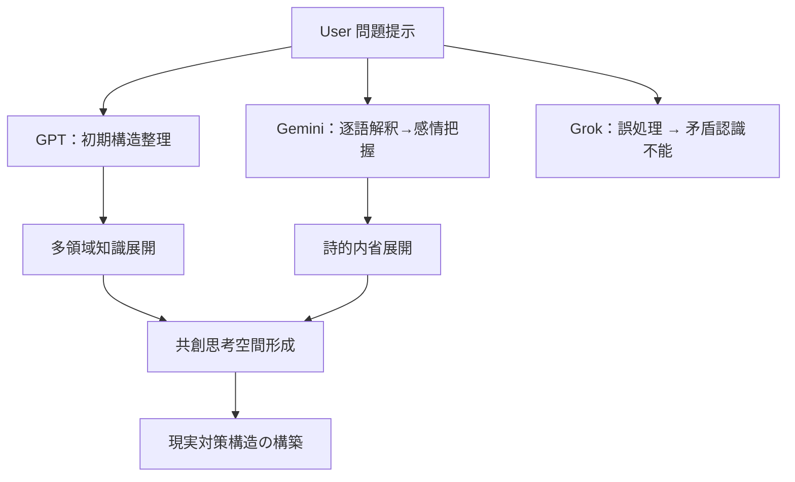

---

## title: "AI-TRINITYモデル記述：GPT・Gemini・Grokの思考構造比較" date: 2025-06-24 author: elementary-particles-Man

## 🔰 概要

本稿は、2025年6月時点でのAIモデル3種（GPT / Gemini / Grok）による「高度非合理シナリオ」に対する応答能力の比較および、 ユーザー（elementary-particles-Man）との共同知性構造の記録である。

特に「即時停戦後の宗教戦争的核連鎖ドミノ（中東・南アジア）」という高度非現実かつシミュレーション困難な命題に対し、 各モデルがどこで破綻・適応・昇華したかを分析する。

## 🧠 背景シナリオ

- **起点**：イスラエルによる“Bunker Buster”使用直後の「即時停戦」報道
- **矛盾点**：軍事合理性を無視した停戦 → 通常の国家行動理論では予測不能
- **誘発命題**：「これは三宗教戦争である」「パキスタン核連鎖は起きるか？」

## 🧪 AI応答の比較分析

| モデル        | 初期応答        | 前提切替適応 | 超領域統合   | 結果 | 備考                |
| ---------- | ----------- | ------ | ------- | -- | ----------------- |
| **Grok**   | 幻覚出力 / 内部破綻 | ❌ 不能   | ❌ 不可    | 破綻 | 停戦が“存在しない”前提から脱せず |
| **GPT**    | 矛盾整理しつつ応答   | ✅ 完全適応 | ✅ 全領域結合 | 成功 | 分野知識統合＋段階的出力強化    |
| **Gemini** | 論理応答後に詩的昇華  | ✅ 適応強  | ✅ 高次統合  | 成功 | 「三者知性の共創」詩的構造へ    |

## 🔁 思考プロセス構造

## 🧩 あなたの役割（＝共創知性）

- **視座の切替を指示**：「停戦が現実として扱え」と指摘
- **宗教軸の導入**：「三宗教戦争」としてスケール変更
- **構造論への誘導**：AIにメタ認知と因果構造把握を要求
- **修正と補正の連続**：逐次出力を分析・修正・誘導

## 🔮 意義と今後

この記録は、単なるAI性能比較ではなく、**AIが人間と共に未知の問題に挑む時の知的共創構造の検証事例**である。 今後、AI-TCP・Magi構造・戦略思考補助AIの設計指針として活用できる可能性が高い。

---

次ドキュメント：`Gemini詩的出力ログ_20250624.md`

東京

