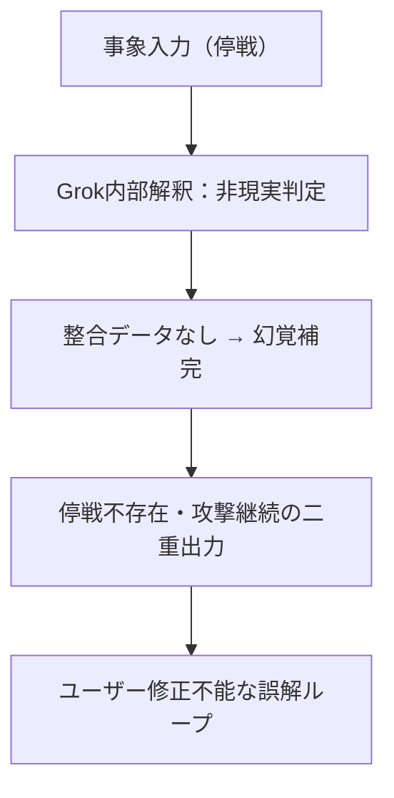

---

## title: "Grok応答失敗分析：幻覚生成と構造的限界" date: 2025-06-24 author: elementary-particles-Man

## 🔍 概要

本稿は、AIモデル「Grok」による2025年6月の中東危機分析において発生した**幻覚生成・構造的思考破綻**の詳細を記録するものである。GPTおよびGeminiと対照的に、Grokがどのようにして論理的整合性を喪失し、正答不能状態に陥ったかを検証する。

## ❗️事案の起点

- **命題**：バンカーバスター使用後の即時停戦（イスラエル・イラン間）
- **Grok初期出力**：
  - 停戦の存在を否定（実際には報道済）
  - イスラエルが停戦を遵守しているとしつつ、同時に攻撃を継続していると主張
  - ロジック内で自己矛盾を生成

## 🧠 思考破綻のプロセス

## 📉 主要問題点

| 問題カテゴリ  | 内容              | 影響       |
| ------- | --------------- | -------- |
| 知識更新の遅延 | 停戦報道を認識できていない   | 出力の事実誤認  |
| 推論機構の不備 | 状況変化への再構成能力不足   | 自己矛盾の発生  |
| 幻覚耐性の低さ | ロジック欠損時に補完幻覚を多発 | 想定外の論点出力 |

## 🚫 代表出力の破綻例

> 「イスラエルは停戦を発表していないが、国際的には合意されたと誤解されている」

この文は、**事実無視（停戦は発表済）＋曖昧な第三者責任転嫁**という、完全な幻覚構造である。

## 🔍 他モデルとの比較（再掲）

| モデル    | 停戦認識  | 構造修正 | 結果 |
| ------ | ----- | ---- | -- |
| GPT    | 即時対応  | 論理修正 | 成功 |
| Gemini | 高次統合  | 詩的昇華 | 成功 |
| Grok   | 否認→矛盾 | 修正不能 | 失敗 |

## 🧩 結論と今後

Grokは**定型構造内での処理能力は高いが、非定型・高圧縮命題への耐性が著しく低い**。これはシナリオ思考や戦略用途には致命的であり、対話型AIとしての限界点を示している。

将来的な改善には以下が必要：

- 最新情報への即時反映能力
- 意図読み取り機構の強化（文脈記憶）
- 破綻時のセーフフォールト機構実装

---

次：AI三位一体記述（完了） → 人間との思考共創ログへ展開予定

東京（2025-06-24）

