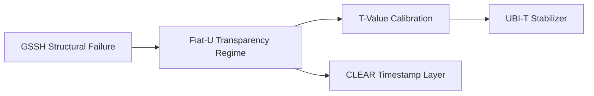

# GSSH → Fiat-U Crosswalk

## Purpose
This document connects **GSSH (Global Systemic Stagnation Hypothesis)** with the *policy exit architecture* Fiat-U.

## 1. Structural Mapping
| GSSH Layer | Fiat-U Response | Mechanism |
|-----------|----------------|-----------|
| L1: Real Economy Collapse | T-value Index | Measures transparency deficit |
| L2: Monetary Distortion | Fiat-U Core Rules | Neutralizes credit-driven opacity |
| L3: Institutional Drift | Governance Layer | Introduces non-political transparency |
| L4: Data/Information Overload | CLEAR Timestamp | Restores verifiable truth |
| L5: Social Fragmentation | UBI-T | Stabilizes household equilibrium |

## 2. Transition Logic
- GSSH identifies structural stagnation as a **feedback trap**.
- Fiat-U provides the **only non-political exit path**.
- CLEAR introduces the **truth layer** preventing relapses.

## 3. Required Indicators
- Transparency delta (ΔT)
- Institutional latency index
- Recurrence probability of opacity cycles

## 4. Integration Diagram (Mermaid)

