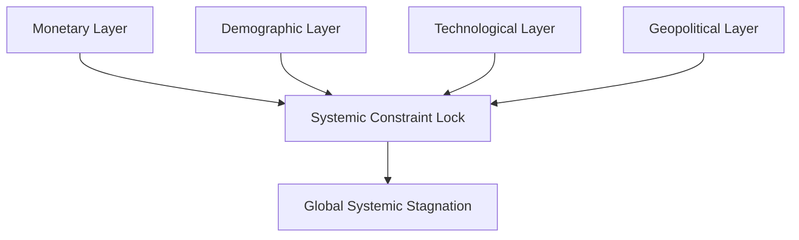
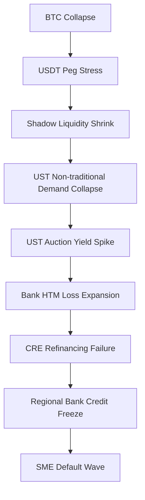

# Global Systemic Stagnation Hypothesis (GSSH)
### IMF Working Paper — Draft, Not for Citation

---

## 1. Abstract
The Global Systemic Stagnation Hypothesis (GSSH) proposes that the world economy has entered a structurally stagnant state driven by the interaction of four macro-constraints: monetary policy exhaustion, demographic drag, asymmetric technological productivity gains, and geopolitical fragmentation. These constraints form a reinforcing system that reduces policy effectiveness, suppresses productivity, and generates political instability. This document presents a conceptual draft of the framework.

---

## 2. Introduction
Since 2020, global macroeconomic patterns have diverged from established models: inflation persists despite tightening, productivity stagnates despite technological innovation, and geopolitical tensions have risen to systemic levels. Traditional frameworks treat these forces independently. GSSH argues that a multi-layer system of constraints is producing a unified stagnation dynamic.

This is a draft working paper and not a finalized theory.

---

## 3. Conceptual Context and Literature Positioning
Existing research addresses stagnation and structural decline from distinct viewpoints:
- Secular stagnation (Summers): demand-side persistence.
- Demographic-economic slowdown (OECD, UN): shrinking workforces.
- Technology-induced inequality (Piketty, Brynjolfsson & McAfee).
- Geopolitical fragmentation (IMF WEO 2023–2025).

GSSH integrates these strands into a single multi-layer causal model.

---

## 4. Framework: Systemic Constraint Layers
GSSH identifies four primary constraint layers:

### 4.1 Monetary Constraint Layer
Declining marginal impact of monetary policy, diminishing transmission, and fiat rigidity.

### 4.2 Demographic Constraint Layer
Aging populations, declining fertility, shrinking labor supply.

### 4.3 Technological Constraint Layer
AI-driven capital concentration and asymmetric productivity distribution.

### 4.4 Geopolitical Constraint Layer
Fragmentation, sanctions, supply-chain bifurcation, bloc formation.

A diagram of the interaction is provided in `Appendix A`.

---

## 5. Mechanism: Multi-Layer Interaction and Reinforcing Loops
The stagnation dynamic emerges from interactions among the constraint layers:

1. Monetary exhaustion reduces demand responsiveness.
2. Weak demand depresses productivity.
3. Low productivity weakens real investment.
4. AI-driven gains disproportionately accrue to capital-intensive sectors.
5. Concentration increases political instability.
6. Instability further weakens monetary transmission.

This creates a self-reinforcing stagnation loop.

A causal flowchart is provided in `Appendix B`.

---

## 6. Indicators and Monitoring Architecture
Key indicators for detecting systemic stagnation include:
- Fiscal and monetary multiplier responsiveness decline.
- Dependency ratio acceleration.
- AI productivity asymmetry index.
- Global fragmentation index.
- Divergence in risk premiums across geopolitical blocs.
- Real investment stagnation.
- Financial-layer triggers such as USDT peg stress, UST auction yield spikes, CRE refinancing failure clusters.

---

## 7. Implications for Macro Policy and Global Governance
Preliminary implications:

1. Monetary policy alone cannot restore growth.
2. Demographic revitalization requires multi-decade structural planning.
3. Technological gains must be redistributed through systemic frameworks.
4. Global governance must address fragmentation-induced inefficiencies.

This framework positions **Fiat-U** as a transparency-oriented complement rather than a replacement for existing monetary structures.

---

## 8. Limitations and Scope of Draft
This is a conceptual draft with several limitations:
- No quantitative estimates of constraint weights.
- Incomplete modeling of AI regional asymmetry.
- Preliminary treatment of geopolitical fragmentation metrics.
- Financial sublayer treated only in outline form.

Further work will expand each layer with empirical foundations.

---

## 9. Appendices

### Appendix A — Layer Interaction Diagram

---

### Appendix B — Reinforcing Feedback Loop

---

### Appendix C — Financial Sublayer Trigger Chain

---

End of Draft Working Paper.
