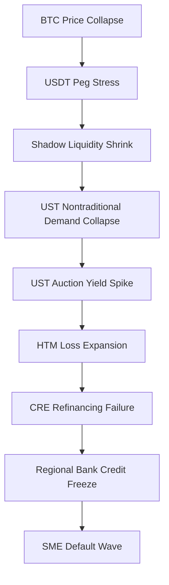

# Global Systemic Stagnation Hypothesis — Financial Sublayer Note
### BIS Working Note — Draft Version, Not for Citation

## 1. Summary
This note focuses on the financial amplifiers within the GSSH framework, particularly the interaction of crypto-liquidity, UST demand, CRE refinancing cycles, and regional bank fragility.

## 2. Structural Forces
Key structural forces relevant to BIS analysis:
- Declining monetary transmission.
- AI-driven capital concentration.
- Demographic drag reducing credit demand.
- Geopolitical fragmentation increasing risk premiums.

## 3. Financial Amplifiers
A cascade mechanism is identified:

## 4. Systemic Risks
- Loss of stablecoin liquidity removes a major source of UST marginal demand.
- CRE refinancing clusters (e.g., Dec 15) amplify bank capital risk.
- Regional banks propagate liquidity freezes through SME credit channels.
- Rising geopolitical uncertainty increases volatility of UST auctions.

## 5. Monitoring Indicators
- USDT stress index.
- UST bid-to-cover ratios.
- CRE delinquency + refinancing concentration.
- HTM unrealized losses.
- SME default acceleration.

## 6. Implications
The financial sublayer accelerates stagnation by reducing investment and amplifying credit contraction.

Fiat-U may serve as a transparency-enhancing complement for monitoring systemic liquidity.

End of BIS Draft.
