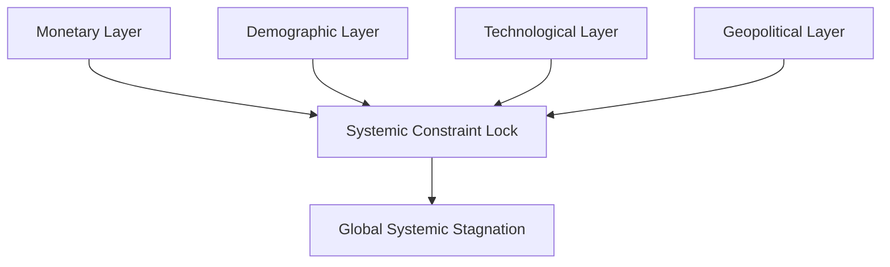

# Global Systemic Stagnation Hypothesis (GSSH)
### OECD Working Paper — Draft Version, Not for Citation

## 1. Executive Summary
The Global Systemic Stagnation Hypothesis (GSSH) proposes that the world economy is constrained by four interacting structural forces: monetary exhaustion, demographic decline, asymmetric technological productivity, and geopolitical fragmentation. These forces jointly create a negative-sum environment for growth.

## 2. Motivation
OECD countries face declining productivity, aging populations, and weakened policy transmission. Despite rapid advances in AI and digital infrastructure, productivity growth is not diffusing across the economy. GSSH provides a unified conceptual model explaining this divergence.

## 3. Conceptual Framework
GSSH identifies four constraint layers:
- **Monetary**: declining stimulus effectiveness.
- **Demographic**: aging and fertility collapse.
- **Technological**: AI-driven productivity asymmetry.
- **Geopolitical**: fragmentation and bloc formation.

## 4. Multi-Layer Analysis
### Monetary Layer
Weak fiscal and monetary multipliers, reduced responsiveness, structural low rates.

### Demographic Layer
Labor force contraction, rising dependency ratios, lower consumption base.

### Technological Layer
AI gains concentrated in capital-intensive sectors; diffusion failure.

### Geopolitical Layer
Trade fragmentation, supply chain duplication, export controls.

## 5. Cross-Country Comparison
Example divergences:
- Japan: demographic dominance.
- US: technological dominance.
- EU: monetary + geopolitical constraints.
- Emerging economies: fragmentation exposure.

## 6. Policy Relevance
- Need for multi-decade demographic strategies.
- Technology diffusion mechanisms.
- Resilience-oriented supply chains.
- Transparency frameworks (e.g., Fiat-U).

## 7. Research Directions
- Quantifying constraint interactions.
- Cross-country AI productivity asymmetry.
- Fiscal transmission under demographic decline.
- Fragmentation risk metrics.

End of OECD Draft.
