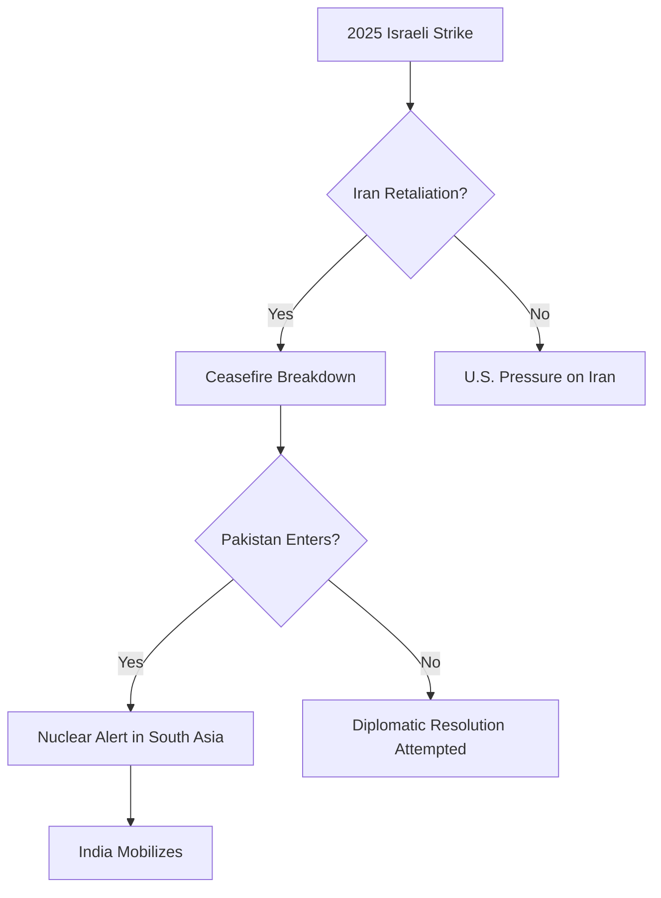

# **The 2025 Global Crisis – An Integrated Analysis of a Tri-Lateral Collapse**

## Executive Summary

The June 2025 global crisis, initiated by Israel’s strike on Iranian nuclear facilities, has rapidly escalated into a multi-front, multi-domain emergency, implicating the Middle East, South Asia, and global diplomatic structures. This report synthesizes real-time AI-generated forecasts, human expert validation, and causal risk modeling.

## Crisis Structure

### 1. Trigger: Israeli Attack on Iran (June 13, 2025)

- **Impact**: Severe geopolitical shock.
    
- **Secondary Effects**:
    
    - Mobilization of Islamic alliances.
        
    - Heightened nuclear alert status.
        

### 2. Fragile Ceasefire & Collapse

- **Date of Ceasefire**: June 15.
    
- **Ceasefire Violation**: Mutual accusations by June 23–24.
    

### 3. Emergence of “Three-Religion War” Dynamics

- **Axis A**: U.S.–Israel–India (Judeo-Christian-Hindu block).
    
- **Axis B**: Iran–Pakistan–Palestinian groups (Islamic bloc).
    
- **Conflict Spread**:
    
    - Increased sectarian polarization.
        
    - Global protests and cyberwarfare incidents.
        

### 4. India-Pakistan Nuclear Flashpoint

- **Catalyst**: Pakistan vows nuclear defense of Islamic sovereignty.
    
- **Response**: Indian military mobilization.
    
- **Risk**: Simultaneous nuclear escalation on two fronts.
    

### 5. Strategic Fracturing in the Gulf

- **Saudi Arabia**: Torn between Islamic legitimacy and U.S. alignment.
    
- **UAE**: Balancing secular AI/economic policy with internal religious sentiment.
    
- **Foreign Nationals**: Evacuation risk rises rapidly.
    

## AI Scenario Tree (Forecast Model: June 24 Version)

## Risk Factors

|Factor|Severity|Notes|
|---|---|---|
|Indo-Pakistani Nuclear Chain|Extreme|Strategic posturing moving toward launch protocols|
|U.S.–Iran–Israel Hostilities|High|Multiple active strike orders and denials|
|Gulf State Instability|High|Internal fractures in Saudi Arabia & UAE|
|DR Capacity (Japan & Allies)|Moderate|Scalable protocols required|

## Recommendations (Tiered)

### Tier 1: Immediate (24–48h)

- Establish secure communication channels with India, UAE, and Saudi Arabia.
    
- Confirm evac asset positioning for nationals in risk zones.
    

### Tier 2: Short-Term (1–7 days)

- DR simulations with NATO-level allies.
    
- Formalize AI-intelligence advisory loops.
    

### Tier 3: Medium-Term (1–4 weeks)

- Launch independent diplomatic initiatives via UN/ASEAN.
    
- Prepare sanctions & trade buffer contingencies.
    

## Appendix

### Table 1: Forecasting Parameters

|Variable|Description|
|---|---|
|DR Index|Disaster Readiness Index|
|Religious Pressure Index|Social cohesion risk due to sectarianism|
|Strategic Commitment Score|Foreign alignment consistency|

### Table 2: Comparative Strike Orders

|Country|Date|Action Taken|
|---|---|---|
|Israel|June 13|Strike on Iran nuclear site|
|Iran|June 14|Regional mobilization|
|Israel|June 24|Renewed military order issued|

