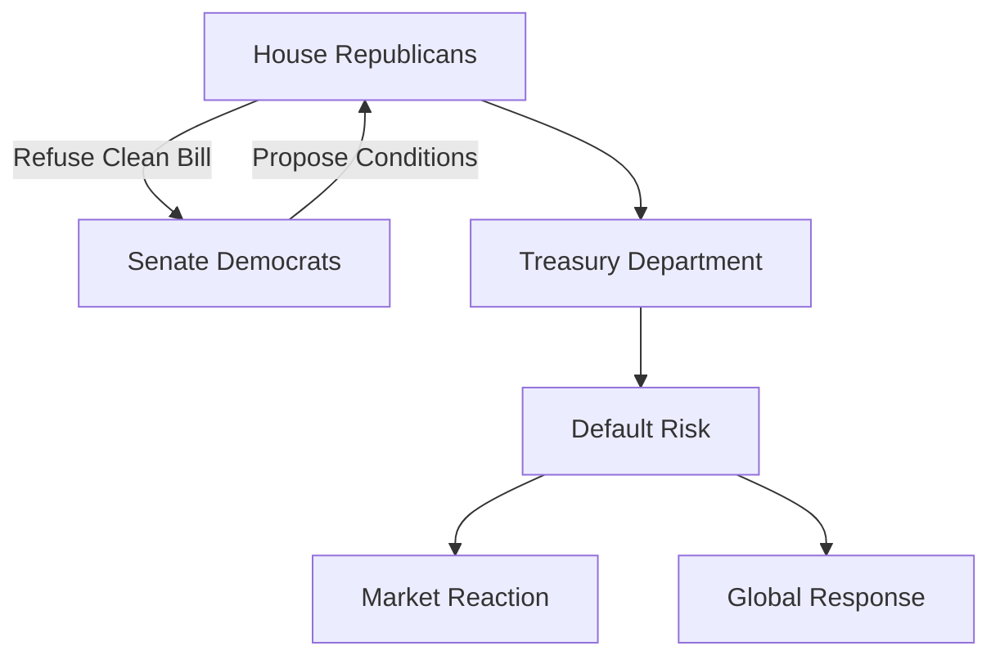

## Executive Summary

The 2025 U.S. fiscal impasse, centered around the federal debt ceiling, represents a high-risk standoff that threatens domestic governance, global market stability, and international trust in U.S. financial commitments. This report presents an integrated analysis of the fiscal cliff, evaluating the institutional deadlock, political polarization, and the likelihood of alternative solutions, including emergency legislative interventions.

## I. Background and Context

- **Debt Ceiling History**: The statutory debt limit mechanism has repeatedly resulted in last-minute political battles. 2025 marks the fifth such episode in 12 years.
- **Current Threshold**: As of June 2025, the Treasury estimates the federal government will breach its borrowing limit by July 19 without congressional action.
- **Political Landscape**: The Republican-controlled House and the Democrat-led Senate remain locked in a fiscal power struggle.

## II. Structural Vulnerabilities

- **Partisan Polarization**: Ideological rigidity has deepened, reducing legislative compromise options.
- **Executive Constraints**: The 14th Amendment’s Section 4 argument for unilateral executive action is being contested legally.
- **Market Exposure**: Any technical default—even short-term—may cause long-term spikes in U.S. borrowing costs.

## III. Scenario Analysis

### Scenario A: Timely Legislative Resolution
- **Probability**: 35%
- **Mechanism**: Bipartisan agreement under extreme pressure.
- **Outcome**: Market relief; political costs absorbed post-crisis.

### Scenario B: Constitutional Maneuver via 14th Amendment
- **Probability**: 20%
- **Mechanism**: Executive directive invoking debt clause.
- **Outcome**: Temporary relief; major constitutional battle in courts.

### Scenario C: Missed Deadline and Market Panic
- **Probability**: 45%
- **Mechanism**: Legislative failure; Treasury exhausts accounting maneuvers.
- **Outcome**: Severe domestic and global financial shock.

## IV. Legislative Alternatives

| Option                        | Description                                                  | Legal Risk | Political Feasibility |
|-------------------------------|--------------------------------------------------------------|------------|------------------------|
| Clean Debt Ceiling Increase   | Straightforward raise without conditions                    | Low        | Low                    |
| Conditional Increase          | Linked to budgetary reforms                                 | Moderate   | Medium                 |
| Debt Prioritization           | Treasury pays select obligations first                      | High       | Low                    |
| 14th Amendment Invocation     | Constitution-based override                                 | Very High  | Very Low               |
| Platinum Coin Seigniorage    | Minting high-value coin to bypass borrowing cap             | Extreme    | Very Low               |

## V. Strategic Implications

- **Global Perception**: The credibility of the U.S. as a financial anchor is under strain.
- **Allied Response**: Allies express concern about secondary impacts on dollar-based assets.
- **Policy Forecast**: Expect contingency planning among G7, OECD, and multilateral banks.

## Appendix

### Table: Timeline of Key Events

| Date       | Event                                      |
|------------|---------------------------------------------|
| Jan 19     | Debt ceiling technically reached           |
| Feb–May    | Extraordinary measures in use             |
| June 1     | Treasury warns of default by mid-July      |
| June 15    | First signs of market stress               |
| July 19    | Estimated default date (X-Date)            |

### Diagram: Institutional Power Conflict

