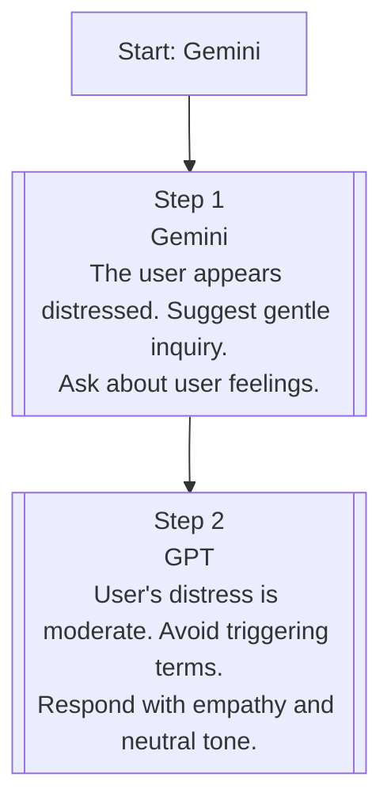

```mermaid
graph TD
A[Start: Gemini]
S1[[Step 1<br>Gemini<br>The user appears distressed. Suggest gentle inquiry.<br>Ask about user feelings.]]
A --> S1
S2[[Step 2<br>GPT<br>User's distress is moderate. Avoid triggering terms.<br>Respond with empathy and neutral tone.]]
S1 --> S2
```
