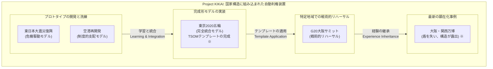
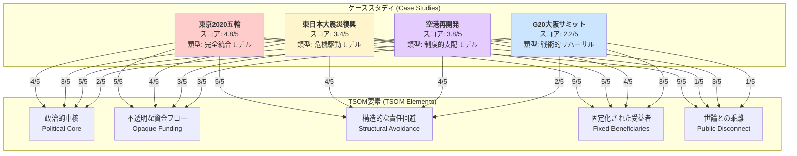
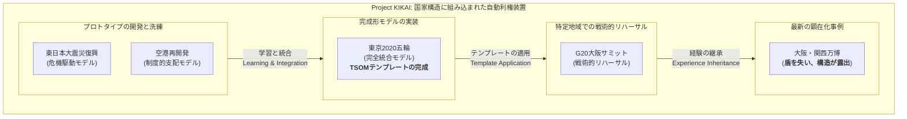

# Project KIKAI：構造分析図解

## 1. TSOM構造フローチャート

この図は、TSOMテンプレートがどのように機能するか、すなわち「誰が」「何を使って」「どの資源をどこからどこへ流したか」という、権限・資金・責任の非対称な流れを定義したものです。

## 2. TSOMプロトタイプ比較マトリクス

この図は、過去の各国家プロジェクトが、TSOMの5つの要素をどの程度満たしていたかをスコアリングし、視覚的に比較するものです。

## 3. Project KIKAI 構造系譜図

この図は、各事例が「Project KIKAI」という巨大な構造の中で、どのように連携し、進化の系譜を形成しているかを示したものです。

