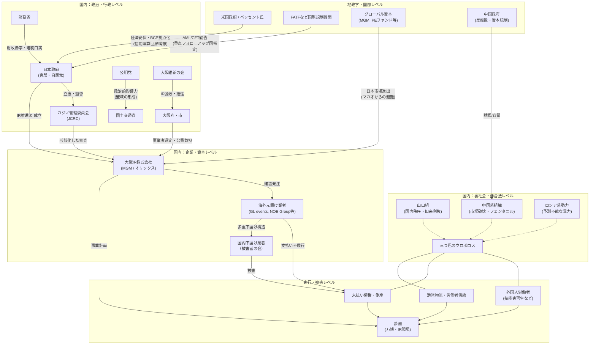

---

### 【最終版】夢洲ゲート 関係者相関図

この相関図は、夢洲ゲート問題が「地政学・国際レベル」「国内の政治・行政レベル」「企業・資本レベル」「裏社会・非合法レベル」そして「実行・被害レベル」という多層的な構造で成り立っていることを示しています。各アクターがどのように相互作用し、この「国家的搾取システム」を形成しているかを可視化します。

```mermaid
graph TD
    subgraph "地政学・国際レベル"
        USA[米国政府 / ベッセント氏]
        FATF[FATFなど国際規制機関]
        GlobalCapital["グローバル資本<br>(MGM, PEファンド等)"]
        ChineseGov["中国政府<br>(反腐敗・資本統制)"]
    end

    subgraph "国内：政治・行政レベル"
        GoJ["日本政府<br>(官邸・自民党)"]
        MOF["財務省"]
        MLIT["国土交通省"]
        Komeito["公明党"]
        Ishin["大阪維新の会"]
        OsakaGov["大阪府・市"]
        JCRC["カジノ管理委員会<br>(JCRC)"]
    end

    subgraph "国内：企業・資本レベル"
        IR_Consortium["大阪IR株式会社<br>(MGM / オリックス)"]
        ForeignContractors["海外元請け業者<br>(GL events, NOE Group等)"]
        Subcontractors["国内下請け業者<br>（被害者の会）"]
    end

    subgraph "国内：裏社会・非合法レベル"
        Ouroboros["三つ巴のウロボロス"]
        Yamaguchi["山口組<br>(国内秩序・旧来利権)"]
        ChineseMafia["中国系組織<br>(市場破壊・フェンタニル)"]
        RussianMafia["ロシア系勢力<br>(予測不能な暴力)"]
    end

    subgraph "実行・被害レベル"
        Yumeshima["夢洲<br>(万博・IR現場)"]
        Port["港湾物流・労働者供給"]
        UnpaidDebts["未払い債権・倒産"]
        ForeignWorkers["外国人労働者<br>(技能実習生など)"]
    end

    %% 政治・行政と企業の関係
    GoJ -- "IR推進法 成立" --> IR_Consortium
    Ishin -- "IR誘致・推進" --> OsakaGov
    OsakaGov -- "事業者選定・公費負担" --> IR_Consortium
    Komeito -- "政治的影響力<br>(聖域の形成)" --> MLIT
    GoJ -- "立法・監督" --> JCRC
    JCRC -- "形骸化した審査" --> IR_Consortium

    %% 企業と実行・被害の関係
    IR_Consortium -- "事業計画" --> Yumeshima
    GlobalCapital -- "日本市場進出<br>(マカオからの避難)" --> IR_Consortium
    IR_Consortium -- "建設発注" --> ForeignContractors
    ForeignContractors -- "多重下請け構造" --> Subcontractors
    ForeignContractors -- "支払い不履行" --> UnpaidDebts
    Subcontractors -- "被害" --> UnpaidDebts

    %% 裏社会と実行・被害の関係
    Ouroboros --- Port
    Ouroboros --- UnpaidDebts
    Ouroboros --- ForeignWorkers
    Yamaguchi -.-> Ouroboros
    ChineseMafia -.-> Ouroboros
    RussianMafia -.-> Ouroboros
    ChineseGov -- "黙認/背景" --> ChineseMafia

    %% 国際機関と国内の関係
    USA -- "経済安保・BCP拠点化<br>(信用演算回廊構想)" --> GoJ
    FATF -- "AML/CFT勧告<br>(重点フォローアップ国指定)" --> GoJ
    MOF -- "財政赤字・増税口実" --> GoJ

    %% 物理的な場所との関係
    Port --> Yumeshima
    UnpaidDebts --> Yumeshima
    ForeignWorkers --> Yumeshima
```