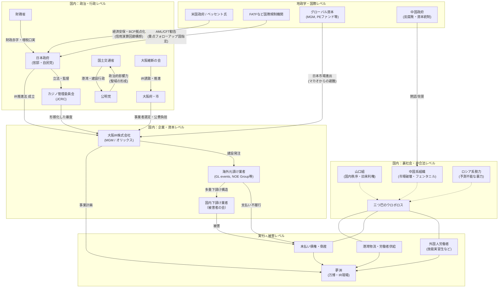
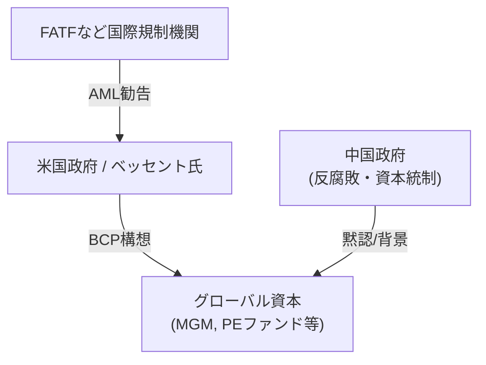
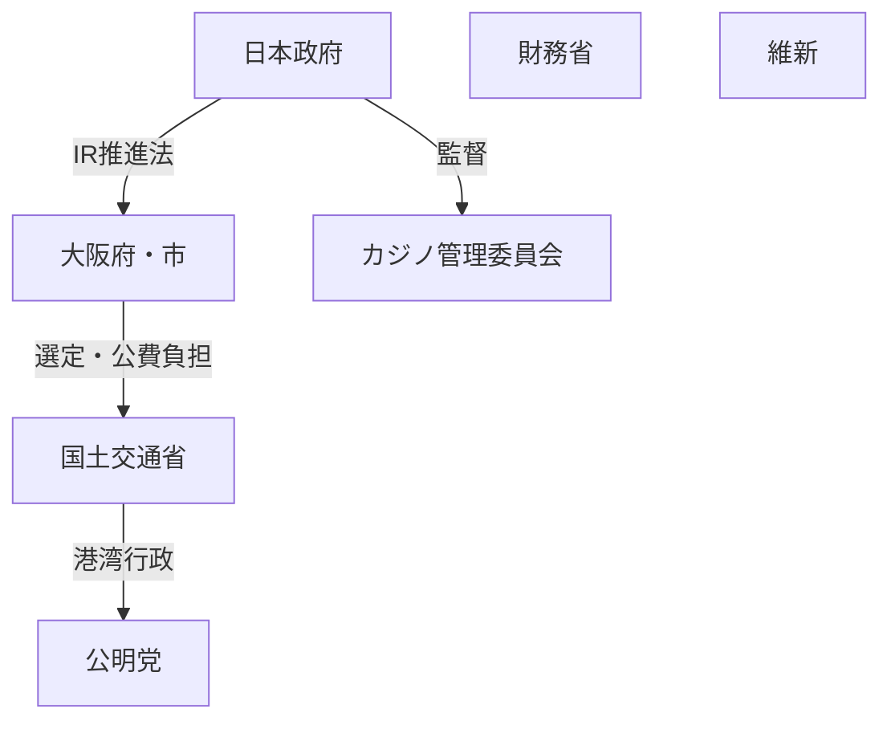
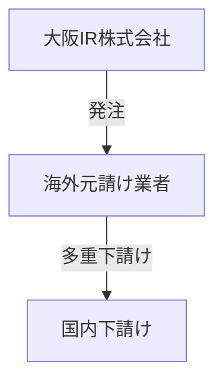
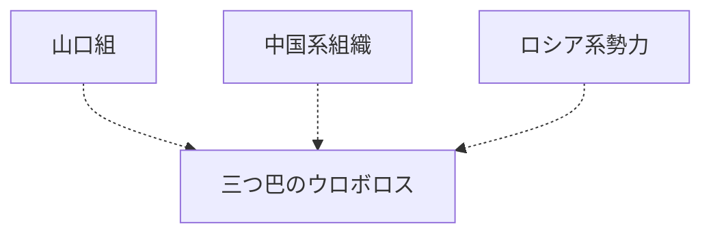
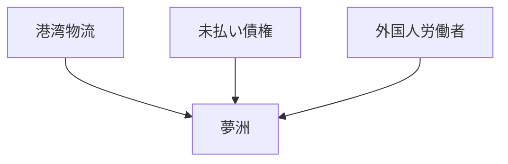

---

## ◆ 【全体相関図】

---

## ◆ 【1】地政学・国際レベル

### ▶ 【ナラティブ】

- **USA（ベッセント）**  
    信用演算回廊構想の起爆役。7/19来阪は唯一の現実ファクト。
    
- **FATF**  
    港湾・IRを含むマネロン構造に国際圧力。
    
- **GlobalCapital**  
    マカオ資本が大阪IRに逃げ込む危険性。
    
- **中国政府**  
    表では反腐敗、裏では地下資本黙認。
    

---

## ◆ 【2】国内：政治・行政レベル

### ▶ 【ナラティブ】

- **GoJ（官邸）**  
    IR推進の立法責任。監督責任の形骸化も抱える。
    
- **MOF（財務省）**  
    港湾補助金・徴税で資金流を制御。増税ロジックの一翼。
    
- **MLIT（国交省）**  
    港湾荷役と建設利権の司令塔。公明党と不可分。
    
- **Komeito（公明党）**  
    港湾労組・経団連とのパイプ役。影響力の聖域化。
    
- **Ishin（維新）/ OsakaGov**  
    IR誘致と現場推進。治安制御の緩さが弱点。
    
- **JCRC**  
    IR審査の形骸化。
    

---

## ◆ 【3】国内：企業・資本レベル

### ▶ 【ナラティブ】

- **IRコンソーシアム（MGM/オリックス）**  
    巨額資金の受け皿。資金流とAMLリスク。
    
- **海外元請け業者**  
    多重下請け構造で未払い・債権買い取りがブラックボックス。
    
- **下請け被害者**  
    倒産後の労働力流出が裏社会の温床。
    

---

## ◆ 【4】裏社会・非合法レベル

### ▶ 【ナラティブ】

- **三つ巴ウロボロス**  
    国内秩序（山口組） vs 市場破壊（中国系） vs 予測不能（ロシア系）
    
- 港湾・債権買い取り・外国人労働力で接点を持つ。
    

---

## ◆ 【5】実行・被害レベル

### ▶ 【ナラティブ】

- **夢洲**  
    万博・IRの物理ゲート。すべての資金・物流が集まる。
    
- **港湾物流**  
    密輸・労働力供給の物理チャネル。
    
- **外国人労働者**  
    雇用不安が裏社会流入の導火線。