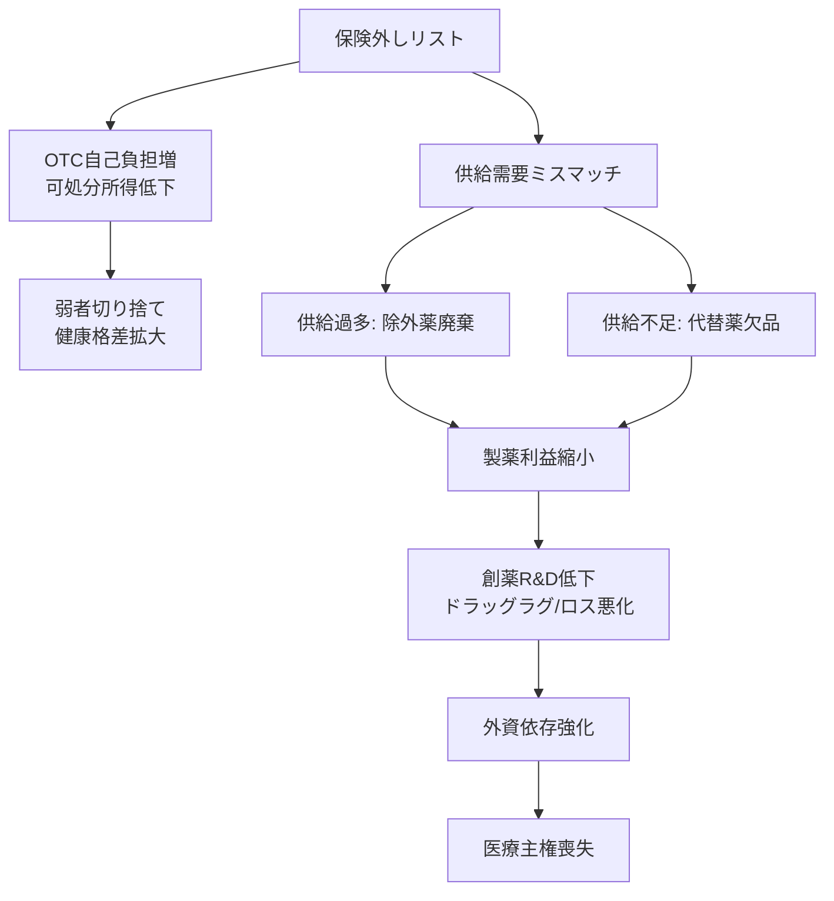
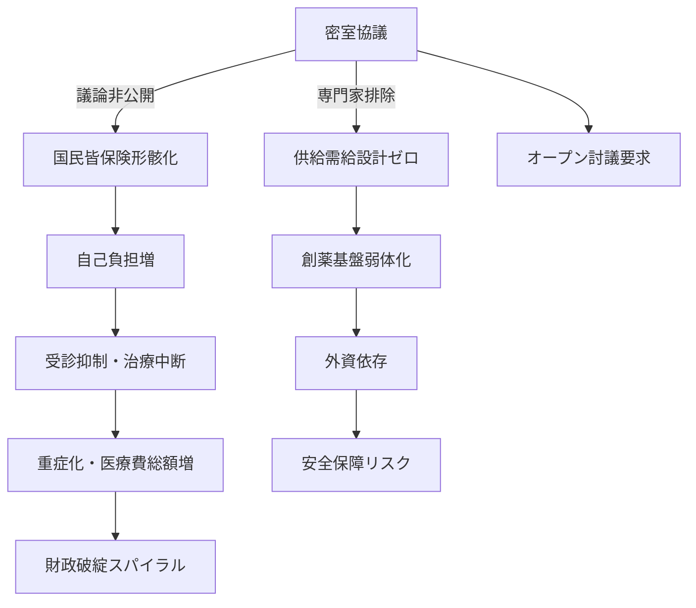
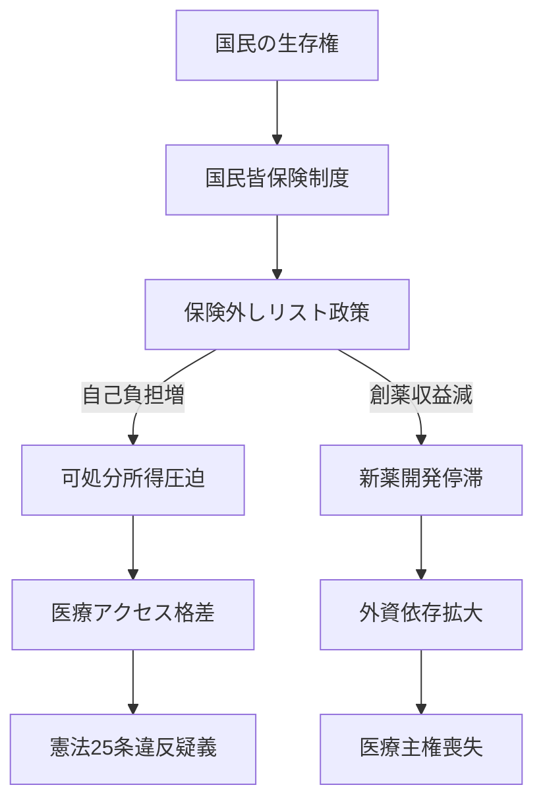
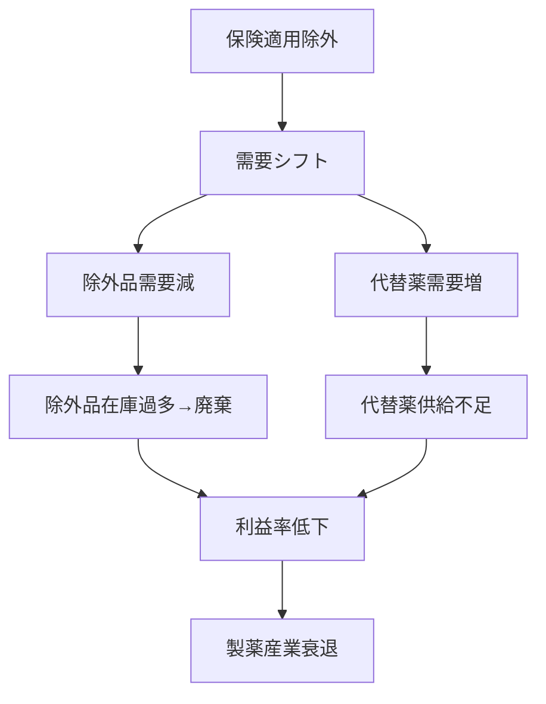
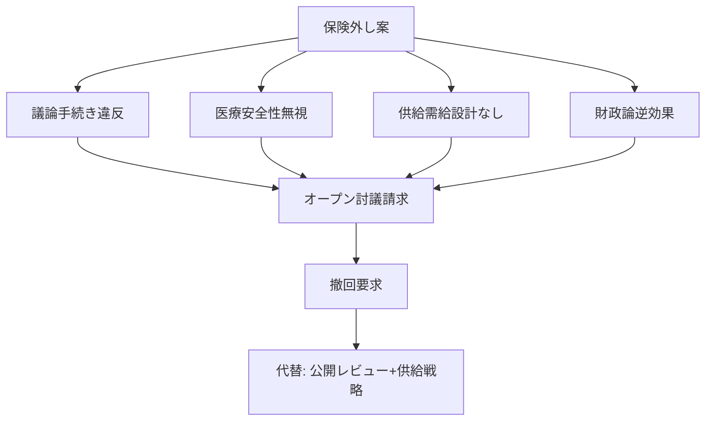

## **① シンプル因果関係（政策→影響）**

```mermaid
graph TD
  A[保険外しリスト] --> B[OTC自己負担増<br>可処分所得低下]
  B --> C[弱者切り捨て<br>健康格差拡大]
  A --> D[供給需要ミスマッチ]
  D --> E[供給過多: 除外薬廃棄]
  D --> F[供給不足: 代替薬欠品]
  E --> G[製薬利益縮小]
  F --> G
  G --> H[創薬R&D低下<br>ドラッグラグ/ロス悪化]
  H --> I[外資依存強化]
  I --> J[医療主権喪失]
```

## ② 政策構造＋オープン討議軸

```mermaid
flowchart TD
  P[密室協議] -->|議論非公開| Q[国民皆保険形骸化]
  Q --> R[自己負担増]
  R --> S[受診抑制・治療中断]
  S --> T[重症化・医療費総額増]
  T --> U[財政破綻スパイラル]
  P -->|専門家排除| V[供給需給設計ゼロ]
  V --> W[創薬基盤弱体化]
  W --> X[外資依存]
  X --> Y[安全保障リスク]
  P --> Z[オープン討議要求]
```

## ③ 生存権フロー

```mermaid
flowchart TD
  ROOT[国民の生存権] --> L1[国民皆保険制度]
  L1 --> L2[保険外しリスト政策]
  L2 -->|自己負担増| L3[可処分所得圧迫]
  L3 --> L4[医療アクセス格差]
  L4 --> L5[憲法25条違反疑義]
  L2 -->|創薬収益減| L6[新薬開発停滞]
  L6 --> L7[外資依存拡大]
  L7 --> L8[医療主権喪失]
```

## ④ 供給面のみ分解（供給過多と供給不足の同時発生）

```mermaid
graph TD
  A[保険適用除外] --> B[需要シフト]
  B --> C[除外品需要減]
  B --> D[代替薬需要増]
  C --> E[除外品在庫過多→廃棄]
  D --> F[代替薬供給不足]
  E --> G[利益率低下]
  F --> G
  G --> H[製薬産業衰退]
```

## ⑤ 政策撤回モデル（提案案）

```mermaid
flowchart TD
  POL[保険外し案] --> X1[議論手続き違反]
  POL --> X2[医療安全性無視]
  POL --> X3[供給需給設計なし]
  POL --> X4[財政論逆効果]
  X1 --> X5[オープン討議請求]
  X2 --> X5
  X3 --> X5
  X4 --> X5
  X5 --> X6[撤回要求]
  X6 --> X7[代替: 公開レビュー+供給戦略]
```

