# THP-CLEAR 全体構成図

**文書ID:** THP-CLEAR-ARCH-v1.0 **ステータス:** 政策提言 添付資料

以下にTHP-CLEARシステムの全体構成と主要なデータフローを示す。

図1. THP-CLEAR ネットワーク構成図（主要コンポーネントとデータフロー）

*注：100台・人道構成サンプル＝MQ40 / WN50 / DB10。拡張時は KMS Ring（3台以上／quorum=2）を維持。*

### コンポーネントの役割

- **G1: MQ（Message Queue）ノードクラスタ (20台)**
    
    - **責務:** 外部からの決済ログ通知の**受付窓口**。リクエストをキューイングし、負荷に応じて後段のWNノードへタスクを分散する。
        
    - **機能:** キューの溢れを検知し、他のMQノードへリクエストを転送する**バックプレッシャー機能**を持つ。
        
- **G2: WN（Worker Node）ノードクラスタ (60台)**
    
    - **責務:** システムの**頭脳**。MQからタスクを受け取り、E-20ネットワークに問い合わせてトランザクションの正当性を検証（ファイナリティ確認）。
        
    - **機能:** ベンダー署名とブロックチェーン上のデータを突合し、正当性が確認された場合にのみ、暗号署名を付与した**Witnessログ**を生成する。
        
- **G3: DB（Database）ノードクラスタ (20台)**
    
    - **責務:** システムの**記憶装置**。WNから送られてきたWitnessログを検証し、改竄不可能な追記専用（WORM）ストレージへ永続化する。
        
    - **機能:** ISE暗号の検証、ログのアーカイブ、長期保管を担当。ディスク容量の閾値を超えると自動で受付を停止し、物理交換を促す。
        
- **KMS Ring（Key Management Service / 3台以上・quorum=2）**
    
    - **責務:** ネットワーク全体の**信頼の基点**。各ノードの認証と、10分毎に更新される暗号鍵の配布を担う。
        
    - **機能:** KMS（鍵管理サービス）は **独立した KMS Ring（3台以上／quorum=2）** として動作し、MQ とは別プロセスのクラスタで提供。Challenge段のみフェイルオーバーを許容し、Submitは同一KMSエンドポイントに固定する（セッションTTL／上限制御）。チャレンジ・レスポンス認証、DECOYキーの発行、SPY_ALERTによる不正ノードの検知・隔離を行い、**2-of-3のマルチシグネチャ**で単一障害点を排除。
        
- **監視・監査**
    
    - **責務:** 全ノードの稼働状況と処理内容をリアルタイムで可視化する。
        
    - **機能:** Prometheusによるメトリクス収集と、JSONL形式での監査ログ出力を担う。

<!-- Mermaid source (for updates only): assets/diagrams/thp_clear_arch_network.mmd -->
