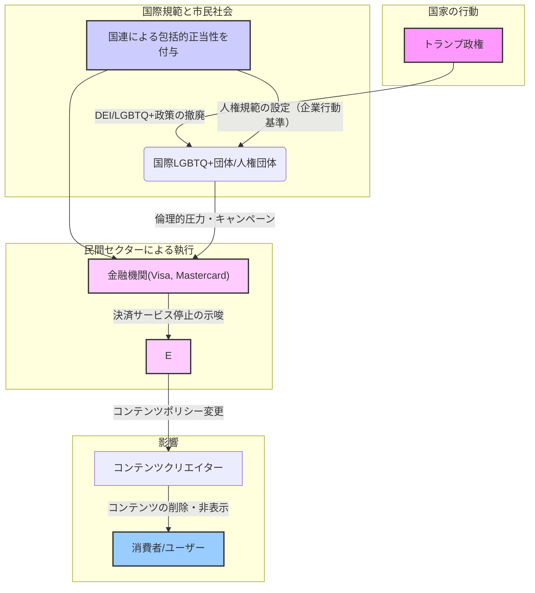

# 国際LGBT団体の報復構造と制度連鎖への影響分析

## 序論

本報告書は、2025年1月以降の第2期トランプ政権によるDEI（多様性・公平性・包括性）およびLGBTQ+関連政策の撤廃が引き金となり、国際的な人権擁護団体、多国間機関、そして金融・テクノロジー企業が連携する「制度的報復」の構造が形成・加速されたという仮説を検証する。この構造は、国家の政策変更に対し、直接的な国家間交渉ではなく、グローバルなサプライチェーンやデジタルプラットフォームを介した非対称的な圧力を行使する点に特徴がある。本稿では、DEI撤廃から国連（UN）の規範設定、金融機関による圧力、そして最終的な文化・表現コンテンツの検閲に至る一連の制度連鎖を解明し、その中で生じる「表現の自由」と「倫理的正義」の制度的対立を分析する。

---

## 1. 触媒：トランプ政権によるDEI・LGBTQ+政策の撤廃

制度的報復の連鎖は、第2期トランプ政権による一連の政策転換によって誘発された。保守系シンクタンク「ヘリテージ財団」が主導する「プロジェクト2025」の青写真に基づき、政権は発足直後からDEIおよびLGBTQ+関連の枠組みを解体する大統領令を次々と発令した 。  

主要な大統領令は、連邦政府内における「性別（sex）」を「出産の際に割り当てられた変更不可能な生物学的二元論」として厳格に再定義し、「ジェンダー・アイデンティティ」という概念を連邦政府のあらゆる規則、文書、コミュニケーションから排除することを義務付けた 。これにより、DEI関連部署の即時廃止 、トランスジェンダーの軍務服務禁止の復活 、ジェンダー肯定医療への連邦資金提供の停止 、連邦刑務所における受刑者の生物学的性別に基づく収容 など、広範な分野で具体的な措置が講じられた。  

これらの措置は、性的指向やジェンダー・アイデンティティに基づく差別からの保護を確立した最高裁判決（_ボストック対クレイトン郡_）の法的基盤を無力化する狙いがあり 、国内の公民権団体から即座に多数の訴訟が提起された 。この急進的な国内政策の転換は、国際社会における対抗動員の直接的な引き金となった。  

---

## 2. 制度連鎖の起点：国連による人権規範の形成

トランプ政権の政策に対し、国連機関はLGBTQ+の権利を普遍的人権の一部として位置づけることで、報復構造の規範的な土台を構築した。

- **UN Womenの役割**: UN Womenは、ジェンダー平等の追求において、多様な性的指向、ジェンダー・アイデンティティ、ジェンダー表現、性的特徴（SOGIESC）を持つすべての人々の人権と平等を促進することを明確に表明している 。その戦略計画（2022-25）では、ジェンダーに基づく不平等の文脈でSOGIESCを持つ人々を明確に認識し、「誰一人取り残さない」という原則を掲げている 。また、同性愛の非犯罪化を世界的に呼びかけるなど、具体的な政策提言も行っている 。UN Womenが管理する「女性に対する暴力撤廃国連信託基金」は、LBT（レズビアン、バイセクシュアル、トランスジェンダー）女性への暴力撤廃を目指すプロジェクトに資金を提供しており、その総額は2200万ドル以上にのぼる 。  
    
- **OHCHRと企業行動基準**: 国連人権高等弁務官事務所（OHCHR）は、「UN Free & Equal」キャンペーンを主導し、世界中でLGBTIQ+の人々の平等と無差別を推進している 。特に重要なのは、OHCHRが策定した「LGBTIの人々に対する差別に取り組むための企業行動基準」である 。この基準は、企業に対し、職場での差別を撤廃するだけでなく、事業を展開する地域社会において「LGBTIの人々の人権のために立ち上がる（STAND UP）」ことを求めている 。これにより、企業の政治的・社会的な活動が期待される規範的枠組みが形成された。アクセンチュア、アドビ、アップル、グーグル、IBM、IKEA、マイクロソフト、ネスレ、ナイキ、P&G、ユニリーバ、Visaなど、400社以上のグローバル企業がこの基準への支持を表明している 。  
    
- **SOGIに関する独立専門家**: 2016年に設置された「性的指向とジェンダー・アイデンティティ（SOGI）に基づく暴力と差別からの保護に関する独立専門家」は、国連システム内でこの問題に特化した唯一の人権専門家である 。独立専門家は、人権侵害を調査・記録し、テーマ別報告書を作成し、公式な国別訪問を行うことで、特定の国家による人権侵害を国際的な議題へと引き上げる役割を担っている 。このマンデートは、市民社会からの強い支持を受け、2025年7月に3年間の延長が決定された 。  
    

これらの国連機関の活動は、トランプ政権の政策を「国際人権基準からの逸脱」として位置づけ、後述する金融圧力や文化検閲に対する正当性を与える根拠となっている。

---

## 3. 制度的報復の実行：金融圧力と文化検閲

国連によって設定された規範は、市民社会団体を介して、金融インフラを標的とする具体的な圧力へと転換される。このプロセスは、「表現の自由」と「倫理的正義」が衝突する最前線となる。

### 3.1 金融インフラの武器化

決済処理業者であるVisaやMastercardは、それぞれ「Visaインテグリティ・リスク・プログラム（VIRP）」や「事業リスク評価・緩和（BRAM）」といったコンプライアンス・プログラムを運用している 。これらのプログラムは、違法行為だけでなく、「ブランドを損なう活動」からも自社ブランドを保護することを目的としており、その定義は意図的に広範かつ曖昧に設定されている 。  

オーストラリアの活動家団体「コレクティブ・シャウト」は、この仕組みを巧みに利用した 。彼らは、ゲームプラットフォームであるSteamやItch.io上でレイプや近親相姦をテーマにしたゲームが存在することを問題視し、プラットフォームに直接抗議するのではなく、その決済を処理するVisa、Mastercard、PayPalに公開書簡を送付した 。このキャンペーンは、決済処理業者に「評判リスク」を認識させ、BRAM/VIRPプログラムを発動させることを狙ったものであった 。  

### 3.2 プラットフォームの降伏と「民営化された検閲」

決済サービスを失うことは、オンラインプラットフォームにとって事業存続の危機を意味する 。この圧力に屈する形で、Steamは2025年7月、「決済処理業者および関連カードネットワーク、銀行によって定められた規則や基準に違反する可能性のあるコンテンツ」、特に「特定の種類の成人向けコンテンツ」を禁止するようガイドラインを更新した 。  

同様に、Itch.ioは「プラットフォームの中核的な決済インフラを保護するために緊急に行動する必要があった」として、NSFW（職場閲覧注意）タグの付いた全コンテンツを検索結果から一時的に非表示（デインデックス）にする措置を取った 。  

この一連の動きは、国家による直接的な法規制ではなく、民間企業（決済処理業者）が別の民間企業（プラットフォーム）に圧力をかけることでコンテンツを排除する「民営化された検閲」システムを構築した。これは、従来の憲法修正第1条のような言論の自由の保護を回避するものであり、活動家団体が企業の内部リスク管理メカニズムを社会・政治的な目的のために利用する新たな権力行使の形態を示している。この力学は、過去にPatreonやOnlyFansといったプラットフォームでも観察されている 。  

---

## 4. 制度連鎖の構造：ノードグラフ

上記の分析に基づき、DEI撤廃から文化検閲に至る一連の制度連鎖をMermaid記法のノードグラフで以下に示す。

コード スニペット

---

## 5. 表現規制の対象となったコンテンツの例

決済処理業者からの圧力により、SteamおよびItch.ioで削除または非表示（デインデックス）の対象となったコンテンツには、以下のようなものが含まれる。

- **特定のテーマを持つゲーム**:
    
    - **No Mercy**: 近親相姦とレイプをテーマにしており、コレクティブ・シャウトのキャンペーンの直接的なきっかけとなった 。  
        
    - **Interactive Sex / Sex Adventuresシリーズ**: 近親相姦をテーマにした複数のゲームがSteamから削除された 。  
        
- **広範なカテゴリに及ぶ影響**:
    
    - **NSFW（職場閲覧注意）コンテンツ全般**: Itch.ioでは、決済処理業者の要請に応じるため、NSFWタグが付いた7,000以上のコンテンツが一斉にデインデックスされた 。  
        
    - **LGBTQ+関連コンテンツ**: 決済処理業者の圧力による自主規制の強化は、必ずしも過激な性的コンテンツだけでなく、受賞歴のあるデベロッパーRobert Yangの『Radiator 2』のような、クィアなアイデンティティやセクシュアリティを探求するゲームにも影響を及ぼした 。これは、LGBTQ+に関する表現が、それ自体「物議を醸す」または「成人向け」と見なされ、一括して規制対象となるリスクを示唆している。  
        

---

## 結論

トランプ政権による急進的な反DEI・LGBTQ+政策は、国際的な人権擁護ネットワークによる巧妙な「制度的報復」を誘発した。この報復構造は、国連機関が設定した人権規範を正当性の根拠とし、活動家団体が企業の評判リスクを突くことで金融インフラを動かし、最終的にデジタルプラットフォームに自主的な検閲を強いるという、一連の制度連鎖によって機能している。

このモデルは、国家主権に基づく従来の法規制の枠組みを迂回し、グローバルなサプライチェーンを通じて事実上の言論統制を可能にする。表現の自由と倫理的正義の対立は、もはや議会や法廷だけでなく、決済処理業者の利用規約やプラットフォームのコンテンツポリシーといった、民間のガバナンス領域で繰り広げられている。この新たな権力構造は、国家、企業、そして個人のクリエイターに対し、地政学的なイデオロギー対立がもたらす新たなリスクに適応することを迫っている。