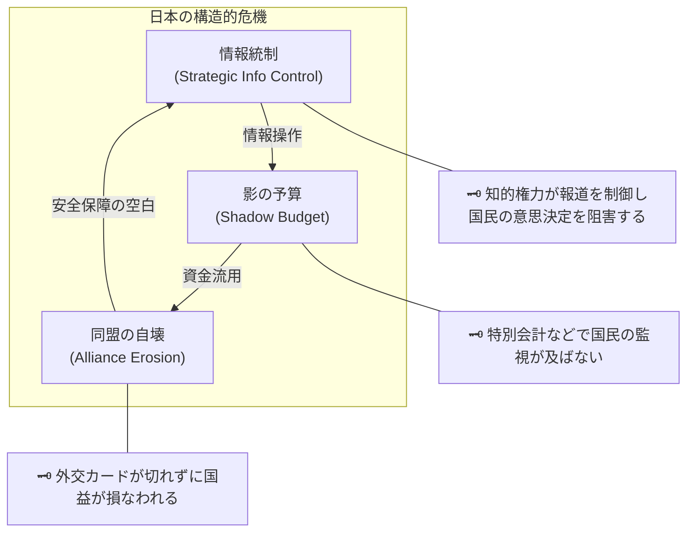

```mermaid
flowchart TD
  A["情報統制<br>(Strategic Info Control)"] 
  B["影の予算<br>(Shadow Budget)"] 
  C["同盟の自壊<br>(Alliance Erosion)"]

  A -->|情報操作| B
  B -->|資金流用| C
  C -->|安全保障の空白| A

  subgraph 日本の構造的危機
    A
    B
    C
  end

  NoteA["🗝️ 知的権力が報道を制御し<br>国民の意思決定を阻害する"]
  NoteB["🗝️ 特別会計などで国民の監視が及ばない"]
  NoteC["🗝️ 外交カードが切れずに国益が損なわれる"]

  A --- NoteA
  B --- NoteB
  C --- NoteC
```