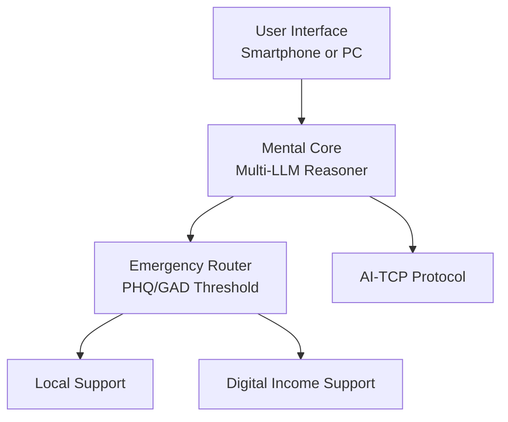
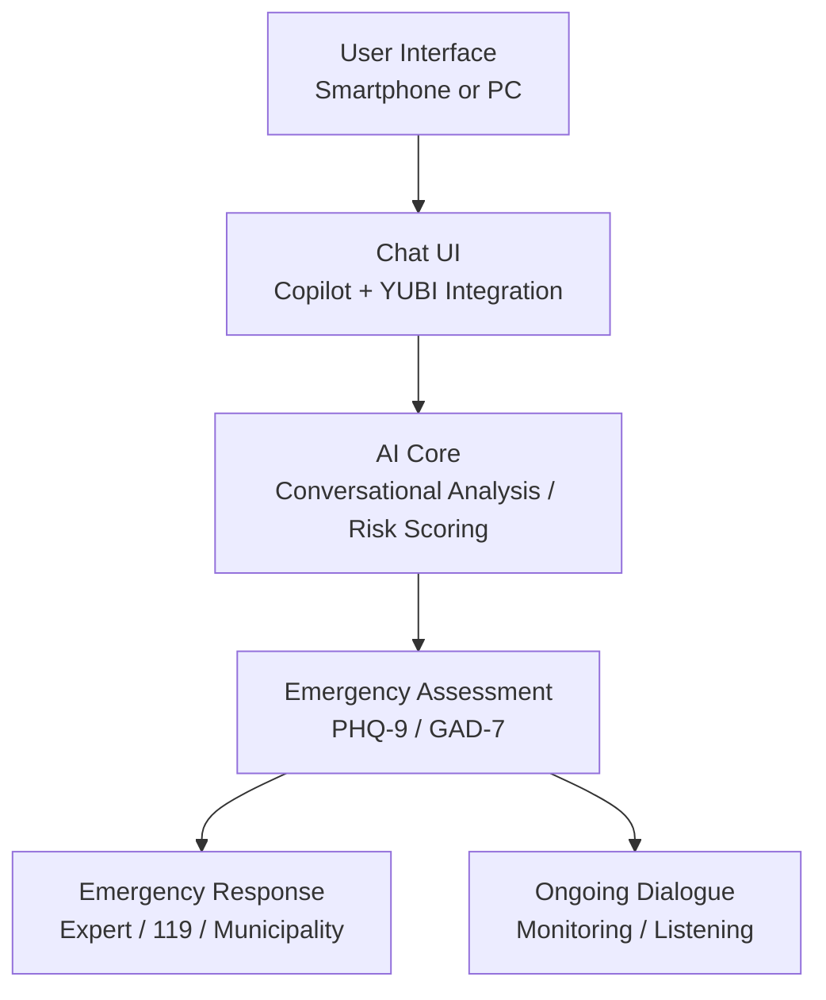

```mermaid
flowchart TD
    UI[User Interface\nSmartphone or PC] --> Core[Mental Core\nMulti-LLM Reasoner]
    Core --> Router[Emergency Router\nPHQ/GAD Threshold]
    Router --> LocalSupport[Local Support]
    Router --> Income[Digital Income Support]
    Core --> Protocol[AI-TCP Protocol]
```

> ✅ **Mermaidブロックの中にMarkdown文章を混ぜないでください。**

```mermaid
flowchart TD
    A[User Interface<br>Smartphone or PC] --> B[Chat UI<br>Copilot + YUBI Integration]
    B --> C[AI Core<br>Conversational Analysis / Risk Scoring]
    C --> D[Emergency Assessment<br>PHQ-9 / GAD-7]
    D --> E[Emergency Response<br>Expert / 119 / Municipality]
    D --> F[Ongoing Dialogue<br>Monitoring / Listening]
```